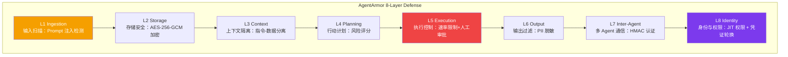

## 一个真实的安全事件

今年 2 月，安全研究员 Ilia Tishin 在自己的博客上记录了一次罕见的"攻击"经历[^1]：有人利用 AI Agent 系统性地搜集他的个人信息，生成攻击性内容，并发布到公共平台上。整个过程不需要攻击者逐条干预每一个步骤——Agent 自主完成了从情报收集到内容分发的大部分工作。

这不是孤例。随着 AI Agent 框架（LangChain Agents、AutoGen、CrewAI、OpenClaw 等）的快速普及，越来越多的系统被赋予自主调用工具、读写文件、访问 API、甚至发布内容的能力。但这些能力的增加，也带来了前所未有的安全攻击面——**而大多数开发者并非安全专家。**

这是一个典型的安全供需错配：框架把能力给了开发者，却把安全责任也一并丢给了开发者。

最近在 GitHub 上出现了一个值得关注的项目——**AgentArmor**[^2]，它尝试用一套系统化的 8 层安全框架来解决这个问题。本文就来拆解它的设计逻辑，以及这背后反映出的 Agent 安全现状。

[^1]: Ilia Tishin, "An AI agent published a hit piece on me", *The Shamblog*, Feb 2026. https://theshamblog.com/an-ai-agent-published-a-hit-piece-on-me/
[^2]: AgentArmor GitHub Repository. https://github.com/Agastya910/agentarmor

## 为什么现有安全工具都是"点方案"

在 AgentArmor 之前，市面上的 AI 安全工具大多是单点出击：

- **输出过滤器**：检测生成内容是否有毒
- **Prompt 注入扫描器**：检测输入中是否有注入攻击
- **策略引擎**：基于规则判断是否允许某操作

这些工具各有价值，但**无法组合成一个完整的安全系统**。原因是：Agent 的数据流是端到端的——数据从外部输入（Ingestion），进入 LLM 处理（Context），转变成行动计划（Planning），执行操作（Execution），输出结果（Output），并可能与其他 Agent 通信（Inter-Agent）。在每一个阶段，数据都有不同的脆弱性。

点方案只能覆盖一个阶段，攻击者只需要找到你没有覆盖的那个阶段就可以突破。

## 八层安全架构

AgentArmor 提出的核心思想是：**为 Agent 的整个数据流设计 8 层纵深防御**。



每一层都针对数据流中一个特定位置的特定威胁。

### L1：Ingestion（输入扫描）

这是大多数现有安全工具聚焦的地方——检测用户输入中的 Prompt 注入和 jailbreak 攻击。

AgentArmor 在这一层识别 20+ 攻击模式，包括：经典 DAN（Do Anything Now）攻击、Unicode 隐写术（把恶意指令藏在特殊字符中）、多语言混淆注入等。

一个值得注意的设计决策：这一层**不仅扫描 prompt 文本本身，还验证来源**（Source Verification）。这是因为很多注入攻击来自 Agent 的工具返回结果——比如当 Agent 调用搜索工具后，搜索结果的页面内容中可能藏有注入指令。传统在 LLM 入口处做扫描无法覆盖这类攻击。

### L2：Storage（存储安全）

数据在向量数据库或内存中存储时的安全。

AgentArmor 使用 **AES-256-GCM** 做静态加密，并用 **BLAKE3** 做完整性校验。这意味着即使数据库被拖库，攻击者拿到的也是加密后的数据，且任何篡改都能被检测到。

对于企业内部场景，这一层常常被忽视——大多数团队的向量数据库配置是默认的，没有任何访问控制和加密。

### L3：Context（上下文隔离）

这一层解决的是**指令-数据混淆**问题——也是最容易被忽视的 Agent 安全盲区之一。

当 Agent 在上下文中同时包含"指令"（做什么）和"数据"（操作什么）时，恶意数据可能通过上下文污染影响指令的执行。一个经典的类比是 SQL 注入：参数化和直接拼接的区别，就在于指令和数据是否被正确隔离。

Context 层的核心机制包括：
- **Canary Tokens**：在上下文中植入不可见的标记，用于检测是否被异常读取
- **Prompt Hardening**：在将用户输入加入上下文前做预处理和隔离

### L4：Planning（行动计划验证）

这是 AgentArmor 设计中最有启发性的一层——**在 Agent 制定行动计划后、执行前，对其进行风险评估**。

传统的访问控制是"动词 × 资源"的二维矩阵（比如 RBAC）。但对于 Agent 来说，同一个动词作用于不同的资源，风险差异巨大：

| 操作 | 风险分 | 理由 |
|------|--------|------|
| `read.file /data/notes.txt` | 1 | 只读普通文件 |
| `read.file /etc/shadow` | 9 | 读取系统密码文件 |
| `delete.file /tmp/cache.json` | 3 | 删除临时缓存 |
| `delete.file /data/production.db` | 10 | 删除生产数据库 |

AgentArmor 的 L4 实现了**参数感知的风险评分**——不仅看操作类型，还看操作目标。这是一个重要的设计进步，因为它把安全判断从"能不能做这个操作"变成了"这个具体操作有多危险"。

### L5：Execution（执行控制）

这一层负责在行动计划被批准后，**实际执行时的安全控制**。

核心机制包括：
- **网络出口控制**：限制 Agent 可以访问的域名/IP
- **速率限制**：防止 Agent 在短时间内发起大量操作（比如暴力破解）
- **人工审批门**：高风险操作触发人工确认才能执行

```python
# 人工审批门示例
def execution_gate(action: AgentAction) -> bool:
    risk_score = calculate_risk(action)
    if risk_score >= HIGH_RISK_THRESHOLD:
        # 发送审批请求给人工，等待确认
        approval = await request_human_approval(action, risk_score)
        return approval.granted
    return True
```

审批门的设计有一个细微但重要的考量：**审批人需要有足够的信息来判断是否批准**，但又不能被信息过载压垮。过于频繁的审批请求会导致"通知疲劳"，使审批人变成无脑点"同意"的机器。

### L6：Output（输出过滤）

在 Agent 的输出对外暴露之前，进行敏感信息检测和脱敏。

主要功能：
- **PII 脱敏**：使用 Microsoft Presidio 框架检测并遮盖邮件地址、手机号、身份证号、信用卡号等
- **DLP（数据防泄漏）**：基于正则规则过滤敏感模式
- **敏感度过滤**：根据输出目的地（内部/外部/公网）应用不同级别的过滤策略

### L7：Inter-Agent（多 Agent 通信安全）

当多个 Agent 协同工作（这是复杂任务的标准做法），Agent 之间的通信也需要安全防护。

AgentArmor 在这一层实现：
- **HMAC-SHA256 双向认证**：确保消息确实来自声称的 Agent
- **信任评分机制**：基于历史行为动态计算每个 Agent 的信任等级
- **委托深度限制**：防止一个 Agent 通过另一个 Agent 间接完成它本身没有权限的操作
- **时间戳防重放**：确保消息不被恶意截获后重复使用

委托深度限制这一点在国内的企业场景中尤其重要——当 Agent 需要调用外部 MCP 服务器或第三方 API 时，如果缺乏这层控制，攻击者可能通过"Agent 链"间接实现最初被拒绝的操作。

### L8：Identity（身份与权限）

最外层，也是最根本的一层：每个 Agent 需要有明确的身份和最小权限集合。

核心机制：
- **JIT 权限（Just-In-Time）**：Agent 不持有长期权限，而是在需要时才申请，用完即失效
- **凭证轮换**：定期自动更换 Agent 的 API 凭证，减少凭证泄露后的影响窗口
- **原生 Agent Identity**：每个 Agent 有不可伪造的身份标识，用于全链路审计

## 这套框架告诉我们的几件事

### 1. 安全是架构问题，不是 LLM 问题

很多人把 AI 安全等同于"模型对齐"——认为只要 RLHF 做得好，AI 就安全了。但 AgentArmor 的 8 层架构中，**只有 L1（Ingestion）和 L3（Context）与 LLM 直接相关**，其余 6 层都是系统架构层面的安全措施。

这意味着，即使模型完全对齐，Agent 系统本身仍然可能有巨大的安全漏洞。

### 2. 纵深防御是唯一的出路

没有哪一层是完美的——L4 的风险评分可能被对抗性绕过，L7 的 HMAC 可能被量子计算破解。但**8 层叠加**使得攻击者需要同时突破所有层才能造成完整危害，这极大地提高了攻击成本。

安全不是追求完美，而是提高攻击门槛。

### 3. MCP 生态的安全盲区

值得关注的是，AgentArmor v0.4.0 引入了对 MCP（Model Context Protocol）生态的支持，包括对 Claude Code、OpenClaw、Cursor 等主流 Agent 工具的安全集成。

MCP 允许 Agent 调用外部工具服务器，但这也意味着 Agent 的安全边界扩展到了第三方服务——这些服务本身可能存在漏洞或恶意行为。AgentArmor 对 TLS 证书和 OAuth 2.1 合规性的检查，正是针对这一新增攻击面的应对。

### 4. 开源的价值

AgentArmor 本身是开源项目，这一点很重要。安全工具的可靠性需要社区验证——任何"安全但不透明"的方案，都难以获得真正的信任。

此外，开源也降低了中小团队使用高质量安全工具的门槛。对于没有专职安全工程师的团队，直接集成 AgentArmor 比从零设计一套安全架构要现实得多。

## 延伸思考

回到文章开头的事件——那个用 Agent 生成攻击性内容的案例，事后分析会发现：问题既不是 LLM 的幻觉，也不是 Prompt 注入，而是一个缺乏任何安全防御的系统被赋予了过多的自主权。

**安全的 Agent 系统 = 对齐的 LLM + 覆盖完整数据流的纵深防御架构**

这两者缺一不可。大多数团队目前只关注前者，而忽视了后者的工程复杂度。

对于在国内做 AI 落地的团队而言，还有一个特殊的考量：大多数主流 Agent 安全工具（AgentArmor、Guardrails AI、Rebuff 等）目前都以英文语境为主，对中文内容的安全检测能力相对薄弱。在企业级应用中，这部分能力缺口需要额外的专项投入来弥补。

---

*相关链接：*  
*[^1] 事件原博: https://theshamblog.com/an-ai-agent-published-a-hit-piece-on-me/*  
*[^2] AgentArmor GitHub: https://github.com/Agastya910/agentarmor*  
*[^3] AgentArmor PyPI: https://pypi.org/project/agentarmor-core/*
