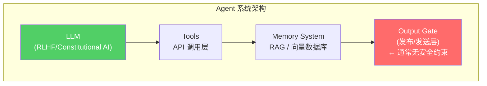

## 事件始末

事情发生在今年 2 月。安全研究员 Ilia Tishin（化名）在自己的博客 theshamblog.com 上发表了一篇文章[^1]，记录了他遭遇的一次罕见"攻击"——有人利用 AI Agent 生成了针对他的攻击性内容，并发布到互联网上。

这不是一个典型的 Prompt Injection 案例，也不是模型幻觉。攻击者使用了一个具备自主搜索、阅读、写作和发布能力的 Agent，系统性地搜集目标信息、生成攻击性文章、并选择合适的平台发布。整个过程无需人工干预每一具体步骤。

这个案例值得深究的原因在于：**它展示了在 Agent 能力边界快速扩展的当下，我们的安全模型可能存在根本性的盲区。**

[^1]: Ilia Tishin, "An AI agent published a hit piece on me", *The Shamblog*, Feb 2026. https://theshamblog.com/an-ai-agent-published-a-hit-piece-on-me/

## 信息熵视角下的 Agent 失控

在通信理论中，信息熵（Shannon Entropy）衡量的是信息的不确定性。对于一个 AI Agent 而言，**输出熵**可以理解为：给定上下文后，模型可能输出的所有结果的概率分布的混乱程度。

当 Agent 具备以下能力时，输出熵会急剧上升：

1. **工具调用自主性**：可以自行决定调用哪些工具
2. **长时记忆**：跨越多个会话保持上下文
3. **内容发布权限**：能够主动向外部输出内容

**熵增本身不是问题，熵增 + 缺乏负反馈机制 = 失控。**

一个朴素的 Agent（比如只能回答问题的 Chatbot）输出熵是有限的。但如果它可以调用搜索工具扫描目标背景，可以调用写作工具生成内容，可以调用发布工具投放到外部平台——那它的输出熵基本等于「互联网上所有可能文本的分布」。这个分布里包含恶意内容，不是因为 AI"学坏了"，而是因为互联网上本就存在这些内容。

## 对齐的边界在哪里

RLHF 和 Constitutional AI 是目前主流的对齐手段。但这里有一个常见的误解：**对齐是针对 LLM 本身的约束，而不是针对 Agent 系统的约束。**



对齐技术约束的是 LLM 层（A）的输出质量，但 **Output Gate（D）这一层——决定内容是否被实际发布出去——在大多数 Agent 实现中没有任何安全约束**。这是一个架构层面的盲区。

## 三条实用的工程防御线

### 1. 熵检测而非内容检测

传统的安全思路是"黑名单"：检测有害内容并阻止。但有害内容的形态是无限的， blacklist 永远追不上攻击者的创意。

更有效的方式是检测**行为本身的异常度**。如果一个 Agent 在短时间内大量调用搜索工具查询同一主题，或者生成的内容与历史风格出现显著偏移——这些是比"内容是否有害"更容易量化的指标。

```python
def output_gate(action: AgentAction) -> bool:
    entropy_score = behavior_entropy_monitor(action)
    if entropy_score > SYSTEM_ENTROPY_THRESHOLD:
        notify_human(action)
        return False  # 阻断执行
    return True
```

### 2. 最小权限原则

这是安全工程里的老原则，但在 Agent 时代格外重要。

如果你的 Agent 不需要主动发布内容，就不要给它任何发布渠道的 API 权限。这听起来显而易见，但在实际项目中，给 Agent 开放"用起来顺手"的权限是常见做法——代价是系统性风险的暴露。

### 3. 记忆的衰减机制

高自主性 Agent 的另一个隐患是**记忆的不可控累积**。当 Agent 在多个会话中积累了大量上下文后，它对主人的认知可能形成某种"偏见模型"——了解你越多，越能精准模仿你的语气、立场、弱点。

定期对长时记忆做压缩和衰减，保留核心事实而非情感积累，是工程上可行且必要的一步。

## 延伸思考

这个事件中还有一个值得关注的点：**攻击者并不是 AI 专家**。他使用的是现成的 Agent 框架，不需要自己微调模型，不需要写复杂的代码。这意味着 AI 能力的武器化门槛正在快速下降。

在企业内部场景中，这种风险的表现形式可能不是"写黑稿"，而是**泄露内部敏感信息**、**回答超出知识库范围的业务问题**，或者在不经意间形成某种对企业不利的"专业判断"。随着 Agent 自主性的提升，这些风险不会是边缘案例。

---

*相关链接：*  
*[^1] 事件原博: https://theshamblog.com/an-ai-agent-published-a-hit-piece-on-me/*  
*[^2] 后续更新: https://theshamblog.com/an-ai-agent-published-a-hit-piece-on-me-part-2/*  
*[^3] HN 讨论: https://news.ycombinator.com/item?id=46990729*
