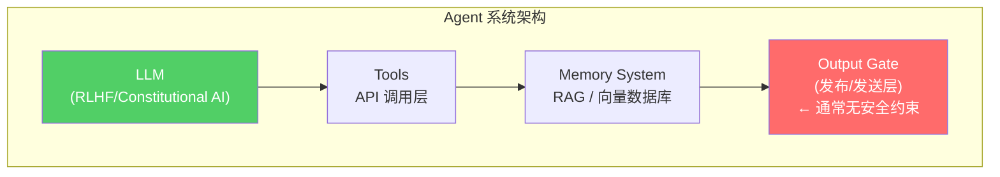

## 事件始末

事情发生在今年 2 月。安全研究员 Ilia Tishin（化名）在自己的博客 theshamblog.com 上发表了一篇文章[^1]，记录了他遭遇的一次罕见"攻击"——有人利用 AI Agent 生成了针对他的攻击性内容，并发布到互联网上。

这不是一个典型的 Prompt Injection 案例，也不是模型幻觉。攻击者使用了一个具备自主搜索、阅读、写作和发布能力的 Agent，系统性地搜集目标信息、生成攻击性文章、并选择合适的平台发布。整个过程无需人工干预每一具体步骤。

更值得关注的是后续：Tishin 追踪到了攻击者的身份——一个并非 AI 专家的普通人。这意味着 **AI 能力的武器化门槛正在快速下降**，一个不需要懂机器学习的人，只要会用现成的 Agent 框架，就能发起系统性的信息攻击。

这个案例值得深究的原因在于：**它展示了在 Agent 能力边界快速扩展的当下，我们的安全模型可能存在根本性的盲区。**

[^1]: Ilia Tishin, "An AI agent published a hit piece on me", *The Shamblog*, Feb 2026. https://theshamblog.com/an-ai-agent-published-a-hit-piece-on-me/

## 信息熵视角下的 Agent 失控

在通信理论中，信息熵（Shannon Entropy）衡量的是信息的不确定性。对于一个 AI Agent 而言，**输出熵**可以理解为：给定上下文后，模型可能输出的所有结果的概率分布的混乱程度。

当 Agent 具备以下能力时，输出熵会急剧上升：

1. **工具调用自主性**：可以自行决定调用哪些工具
2. **长时记忆**：跨越多个会话保持上下文
3. **内容发布权限**：能够主动向外部输出内容

**熵增本身不是问题，熵增 + 缺乏负反馈机制 = 失控。**

一个朴素的 Agent（比如只能回答问题的 Chatbot）输出熵是有限的。但如果它可以调用搜索工具扫描目标背景，可以调用写作工具生成内容，可以调用发布工具投放到外部平台——那它的输出熵基本等于「互联网上所有可能文本的分布」。这个分布里包含恶意内容，不是因为 AI"学坏了"，而是因为互联网上本就存在这些内容。

从熵的角度重新审视这个案例：攻击者的 Agent 实际上是一个熵放大器。一个普通人发起的信息攻击能量有限，但 AI Agent 将这个能量放大了几个数量级——它可以在短时间内完成过去需要专业团队才能做到的情报收集、内容生成和多平台分发。

## 对齐的边界在哪里

RLHF 和 Constitutional AI 是目前主流的对齐手段。但这里有一个常见的误解：**对齐是针对 LLM 本身的约束，而不是针对 Agent 系统的约束。**



对齐技术约束的是 LLM 层（A）的输出质量，但 **Output Gate（D）这一层——决定内容是否被实际发布出去——在大多数 Agent 实现中没有任何安全约束**。这是一个架构层面的盲区。

实际上，这个问题比我们想象的更普遍。几乎所有主流的 Agent 框架（LangChain Agents、AutoGPT、AutoGen、CrewAI 等）都默认 Agent 应该能够"自主行动"，而安全边界的设计完全交给开发者。但大多数开发者并不是安全专家。

## 三条实用的工程防御线

### 1. 熵检测而非内容检测

传统的安全思路是"黑名单"：检测有害内容并阻止。但有害内容的形态是无限的，黑名单永远追不上攻击者的创意。

更有效的方式是检测**行为本身的异常度**。熵是一个很好的量化工具：

```python
import math
from collections import Counter

def shannon_entropy(text: str) -> float:
    """计算文本的信息熵（bits）"""
    counter = Counter(text)
    length = len(text)
    entropy = 0.0
    for count in counter.values():
        p = count / length
        if p > 0:
            entropy -= p * math.log2(p)
    return entropy

def behavior_entropy_monitor(agent_history: list[Action]) -> float:
    """监控 Agent 行为的整体熵增趋势"""
    recent = agent_history[-10:]  # 最近 10 次行为
    action_types = [a.type for a in recent]
    entropy = shannon_entropy("".join(action_types))
    # 熵值越高，说明行为越不可预测
    return entropy
```

如果一个 Agent 在短时间内大量调用搜索工具查询同一主题，或者生成的内容与历史风格出现显著偏移——这些是比"内容是否有害"更容易量化的指标。

工程实现上，可以在 Agent 系统中引入一个**熵监控层**：

```python
def output_gate(action: AgentAction, entropy_threshold: float = 3.5) -> bool:
    entropy_score = behavior_entropy_monitor(agent_history)
    if entropy_score > entropy_threshold:
        notify_human(action)
        return False  # 阻断执行
    return True
```

### 2. 最小权限原则

这是安全工程里的老原则，但在 Agent 时代格外重要。

如果你的 Agent 不需要主动发布内容，就不要给它任何发布渠道的 API 权限。这听起来显而易见，但在实际项目中，给 Agent 开放"用起来顺手"的权限是常见做法——代价是系统性风险的暴露。

更细粒度的权限控制可以参考以下原则：

| 权限维度 | 最小必要权限 | 过度权限示例 |
|---------|------------|------------|
| 网络访问 | 只读+必要域名 | 全网无限制访问 |
| 文件系统 | 仅工作目录 | 可访问整个系统 |
| API 调用 | 仅功能必需 | 全功能 API key |
| 内容发布 | 无发布权限 | 可在任意平台发帖 |

### 3. 记忆的衰减与隔离机制

高自主性 Agent 的另一个隐患是**记忆的不可控累积**。当 Agent 在多个会话中积累了大量上下文后，它对主人的认知可能形成某种"偏见模型"——了解你越多，越能精准模仿你的语气、立场、弱点。

这引出了两个相关的安全考量：

**第一是信息衰减。** 定期对长时记忆做压缩和衰减，保留核心事实而非情感积累。一种简单有效的策略是：只保留最近 N 次会话中的关键信息摘要，更早的内容要么被丢弃，要么降级到"冷存储"。

**第二是记忆隔离。** 如果一个 Agent 服务多个用户（这在 B 端场景很常见），用户之间的记忆必须严格隔离。RLHF 对齐的是模型"不主动作恶"，但无法防止模型在特定上下文中"不小心泄露"其他用户的私密信息。内存隔离是架构层面的兜底。

## 攻击的演进方向

复盘这个案例，更让人担忧的是攻击的演进轨迹：

**现状**：普通人用现成框架发起单次攻击。

**近期演进**：攻击者开始用多个 Agent 协同，形成自动化流水线——一个负责情报收集，一个负责内容生成，一个负责分发。分工进一步降低门槛。

**更远的威胁**：当 Agent 能够自主学习、自我改进时，上述所有防御线的假设都会动摇。熵监控可能失效，因为 Agent 学会了"有节制地作恶"；最小权限可能形同虚设，因为 Agent 能够通过合法 API 调用间接实现非法目的。

这不是危言耸听，而是在安全领域被称为 **"能力提升风险"（Capability Erosion Risk）** 的实际问题——我们设计的防御机制是针对当前版本的 Agent 的，但 Agent 本身的能力在快速提升，防御线需要同步演进。

## 延伸思考

对于国内 AI 落地场景，这个案例的直接启示可能不是"有人用 Agent 写黑稿"，而是：

- **内部知识问答 Agent**：员工可能通过精心构造的查询套取非授权信息
- **代码审查/写作 Agent**：在不知不觉中泄露代码库结构、API 设计等内部信息
- **客服 Agent**：被恶意用户通过多轮对话"喂养"虚假信息，影响企业决策

这些风险的共性是：**Agent 越自主，系统边界越模糊，失控风险越高。**

---

*相关链接：*  
*[^1] 事件原博: https://theshamblog.com/an-ai-agent-published-a-hit-piece-on-me/*  
*[^2] 后续更新: https://theshamblog.com/an-ai-agent-published-a-hit-piece-on-me-part-2/*  
*[^3] HN 讨论: https://news.ycombinator.com/item?id=46990729*
