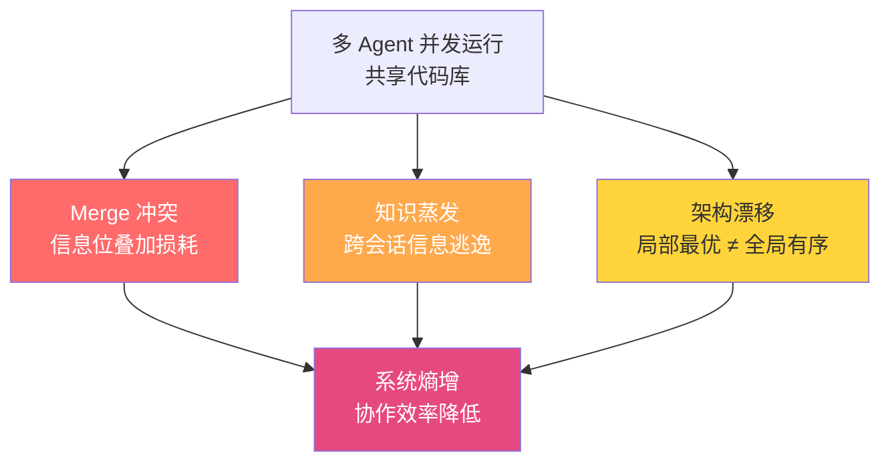
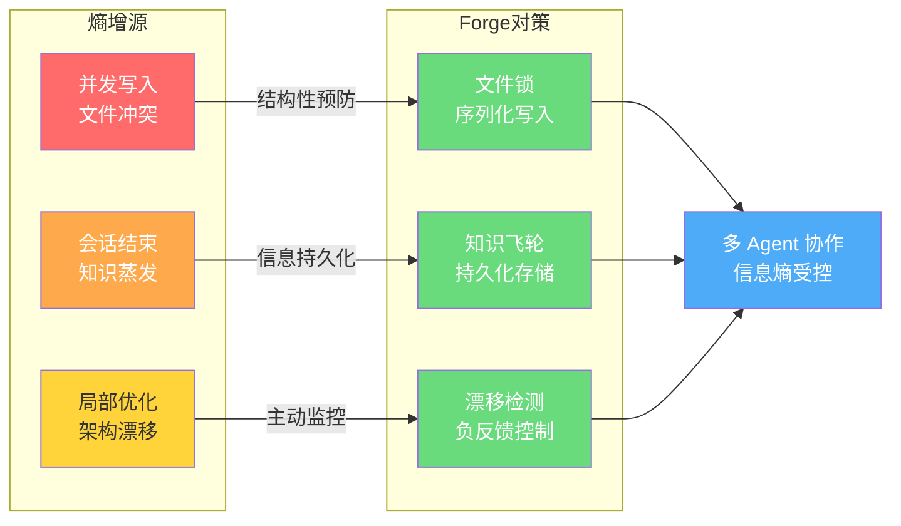

## 引言：当多 AI 并行成为默认

2023 到 2025 年间，AI 编程工具完成了从自动补全引擎到自主 Agent 的进化。Claude Code 能阅读整个代码库、推理架构约束并实现多文件功能。Codex CLI 可以执行 Shell 命令、运行测试并根据失败信息迭代。Gemini CLI 能分析大型代码库并生成全面的重构计划。

每个工具单独使用都足够强大。但当两个或更多工具并发运行时——这在工程团队尝试跨特性分支并行化 AI 辅助开发时越来越常见——问题出现了：**瓶颈从「AI 能否写代码」转移到了「多个 AI 能否在同一代码库上协同工作而不互相摧毁」**。

答案在大多数团队中是「不能」。

本文以 NXTG.AI 开源的 **Forge** 项目[^1]为锚点，用**熵增理论**框架分析多 AI 协作的系统性困境：为什么三个 Agent 并发编辑同一个仓库会产生 merge 冲突、知识蒸发和架构漂移这三种必然的熵增现象，以及 Forge 的文件锁、知识飞轮和漂移检测三个核心机制如何构成一个逆向熵增的工程系统。

---

## 1. 多 AI 协作的三种熵增现象

热力学第二定律告诉我们：孤立系统的熵永不自发减少。多 AI 协作系统在并发运行时就是一个典型的孤立系统——多个自主 Agent 在没有协调层的情况下操作同一个共享资源（代码库），信息熵自发增大，表现为三种具体的系统故障。

### 1.1 Merge 冲突：信息位叠加的不可逆损耗

两个 Agent 同时编辑同一个文件，各自产出了一系列修改。当这些修改最终汇聚到 Git 时，产生了**不可调和的冲突节点**。这不是 Git 的缺陷，而是两个独立信息流在同一个时空中叠加后产生的熵——两个 Agent 在各自的上下文中做出了局部最优决策，这些决策在更高层次上却是互斥的。

从信息论角度，每个 Agent 的编辑可以看作一次信息压缩操作。在单 Agent 场景下，上下文窗口提供了足够的历史信息来保证压缩的一致性。在并发场景下，上下文窗口相互独立，信息压缩失去了共享参考系，熵增体现在**合并时的信息损耗**——必须丢弃一个 Agent 的部分或全部工作。

### 1.2 知识蒸发：跨会话信息的热力学逃逸

Agent A 在一次会话中发现了数据库迁移必须在 API 服务器启动前运行的约束条件。Agent B 运行在完全独立的上下文窗口中，对 Agent A 的发现毫无感知，按错误顺序部署了 API 服务器并花费 20 分钟调试由此产生的问题。

这对应热力学中的**能量逃逸**。在人类团队中，这个问题通过沟通机制解决：站会、Slack 频道、共享文档。在多 Agent 系统中，每个 Agent 的上下文是一个封闭系统，会话结束即系统「热寂」——所有积累的知识随上下文窗口销毁而消失。熵增体现在**跨会话信息传递的失效**。

### 1.3 架构漂移：局部最优导致的全局混沌

没有统一规划的情况下，每个 Agent 都在做局部优化。Agent A 重构了认证模块使用新设计模式。Agent B 对此毫不知情，用旧模式实现了新功能。Agent C 引入了它从训练数据中学到的第三种模式。代码库在无人察觉的情况下逐渐偏离预定架构，每次并发会话都在累积隐性的技术债务。

这类似于热力学中**湍流**的产生：系统各部分遵循局部规则运行，但由于缺乏全局协调，产生了宏观层面的无序结构。架构漂移的可怕之处在于它的**渐进隐蔽性**——每个 Agent 的行为单独看都合理，累积效果却是系统性的混乱。



---

## 2. Forge 的逆向熵增工程系统

Forge 是一个用 Rust 编写的编排层（3MB 单二进制文件，零运行时依赖），通过 MCP（Model Context Protocol）协议协调 Claude Code、Codex CLI 和 Gemini CLI[^1]。它提供了三个核心机制来对抗上文分析的三种熵增现象，构成一个逆向熵增的闭环工程系统。

### 2.1 文件级锁：解决 merge 冲突的结构性屏障

Forge 在 `state.json` 中维护一个 `active_locks` 表。当 Agent 通过 MCP 接口声称一个任务时，Forge 会检查目标文件是否已被其他任务锁定。如果存在锁冲突，任务声称被**拒绝**，并返回清晰的锁定信息（哪个 Agent 持有锁、在做哪个任务）。

这相当于在热力学系统中引入了一个**麦克斯韦妖**——在并发写入发生之前就进行仲裁，而不是事后检测冲突。从熵的角度，锁机制将原本不可控的信息叠加过程转化为一个有序的序列化过程，每次只有一个 Agent 能写入特定文件，系统的信息熵保持在受控范围内。

```json
{
  "active_locks": {
    "src/auth/login.ts": {
      "agent": "claude-code-1",
      "task_id": "task-003",
      "acquired_at": "2026-02-08T14:30:00Z"
    },
    "src/auth/register.ts": {
      "agent": "claude-code-1",
      "task_id": "task-003",
      "acquired_at": "2026-02-08T14:30:00Z"
    }
  }
}
```

Agent 通过 `forge_claim_task` MCP 工具获取任务同时获得文件锁，完成后通过 `forge_complete_task` 释放锁。这是** cooperative lock**（合作锁）——绕过 MCP 接口的 Agent 仍可直写文件，但对于所有通过标准工具运行的 Agent，冲突在结构上已不可能发生。

### 2.2 知识飞轮：跨会话信息的持久化存储

Forge 在 `.forge/knowledge/` 目录下维护一个结构化的知识语料库，存储决策、模式、踩坑记录和经验教训。任何 Agent 在任何会话中都可以调用 `forge_capture_knowledge` 存储新知识，调用 `forge_get_knowledge` 在做决策前查询历史积累。

这个机制对应热力学中的**能量存储与转换**。知识飞轮将原本在会话结束时「热寂」的信息保存到持久化存储中，使下一次会话能够从上一次会话的终点继续，而非从零开始。每次知识捕获都减少了未来会话的探索空间（降低不确定性），对应系统熵的主动降低。

知识飞轮的关键设计是**跨 Agent 普适性**——Claude Code 捕获的知识可以被 Codex CLI 查询使用。这意味着组织学习不再依赖个体（单个 Agent），而是沉淀为共享基础设施。

### 2.3 漂移检测：架构层的一致性监控

Forge 的 `forge_check_drift` 工具将当前代码变更和项目规范发送给配置的大脑引擎（支持免费的启发式 RuleBasedBrain 或 LLM 驱动的 OpenAIBrain），进行对齐评分。这个检查可以在任何时刻由 Agent 或人类调用，返回五维治理评分：测试覆盖、安全、文档、架构对齐和 Git 卫生。

漂移检测是一个**负反馈控制器**。当系统熵增导致架构漂移时，检测机制主动识别偏差并报告给操作者。在自动化场景下，这相当于给系统安装了一个「温度计」——熵增可测量、可报警、可干预。

配合五维健康检查（`forge_get_health`），Forge 提供了持续监控 + 主动检测的双重保障，使多 Agent 系统的架构熵始终处于可观测状态。

---

## 3. 三个机制的系统论视角

将 Forge 的三个核心机制放在一起看，它们构成了一个完整的逆向熵增系统：



值得注意的是，Forge 的状态存储在 `.forge/` 目录下的单个 JSON 文件中——人类可读、Git 可追踪、无运维开销。这意味着**协调状态本身成为了项目知识的一部分**，可以随代码库一起版本化、回滚和审查。

---

## 4. 对 AI 工程实践的启示

Forge 白皮书的核心命题值得所有正在引入 AI 辅助编程的团队思考：当 AI 从工具变成协作者时，工程系统的复杂度从「如何用 AI」变成了「如何让多个 AI 协同工作」。

**文件锁机制**提醒我们：在多 Agent 环境中，**冲突预防优于冲突解决**。Git 的 merge 冲突检测是事后补救，文件锁是事前预防。对于高频并发的 AI 工作流，这个优先级翻转是架构设计的关键。

**知识飞轮机制**揭示了一个更深层的转变：AI 编程的下一阶段不是更强大的单体 Agent，而是**能够积累组织知识的 Agent 协作网络**。单体 Agent 的上下文窗口是有限的，但跨 Agent 的知识持久化使学习能够复合增长。

**漂移检测机制**则将 AI 编程中的架构治理从隐性实践变成了显式工程：测试覆盖、安全扫描、文档完整性这些传统 DevOps 指标，现在需要与架构对齐一起纳入 AI 感知的治理框架。

这三个方向——冲突预防优先、知识复合积累、架构治理显式化——代表了 AI 工程化走向成熟的三个关键节点。

---

## 结语

多 AI 并发协作的困境，本质是一个信息热力学问题：多个自主信息处理单元在无协调的情况下操作共享资源时，系统熵必然自发增大。Forge 的贡献在于，它没有试图让每个 Agent 更聪明（这是模型厂商的工作），而是在 Agent 之上构建了一个**协调基础设施**，用文件锁、知识持久化和漂移检测三个工程机制对抗熵增的自然趋势。

开源地址：https://github.com/nxtg-ai/forge-orchestrator

[^1]: NXTG.AI, "The Forge Whitepaper: Multi-AI Orchestration for Software Development", 2026-02-10. https://nxtg.ai/insights/forge-whitepaper
