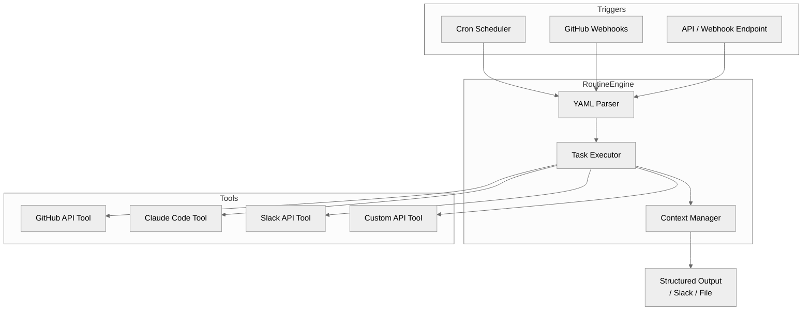

## 真实案例引入：深夜 11 点的 PR 终于有人 review 了

王海（化名）是一家中型 SaaS 公司的后端工程师。团队采用 monorepo 结构，每到周五晚上，积压的 PR 少则七八个，多则十几个。手动 review 耗时耗力，完全丢给 AI review 工具又担心质量。

他尝试的解法：用 Claude Code Routines 配置了一个每周五 20:00 自动运行的代码审查 routine。Claude 会主动拉取本周所有未合并的 PR，按模块分类，生成结构化 review 报告推送到 Slack。第二天早上，他只需要花 20 分钟过一遍 AI 的报告，重点关注高风险变更。

这不是科幻场景——这是 Claude Code Routines 已经支持的真实能力。

---

## 背景：Claude Code 不只是交互式工具

Claude Code 最早以"终端里的 AI 搭档"定位——你提需求，它在本地仓库里翻代码、写文件、跑测试。但这套模式的本质还是**被动响应**：你在，它才动。

2026 年 4 月 14 日，Anthropic 正式发布 **Routines** 功能（[官方文档](https://code.claude.com/docs/en/routines)，HN 热度 700+），将 Claude Code 的能力边界从"交互式"扩展到"自动化"。你可以定义一组任务，让它按时间表、按 GitHub 事件、或按 API 调用触发，在 Anthropic 托管的云端基础设施上自动执行——不需要保持终端打开。

---

## 框架核心拆解

### 触发模型：三种自动化路径

Routines 支持三种触发机制，覆盖了开发者日常中最常见的自动化场景：

**① 定时触发（Cron）**
```yaml
triggers:
  - type: schedule
    cron: "0 9 * * 1-5"   # 每周一至周五 9:00 AM UTC
```
适用于：每日 standup 报告生成、代码质量巡检、定时数据拉取。

**② GitHub 事件触发**
```yaml
triggers:
  - type: github
    events:
      - pull_request.opened
      - pull_request.merged
      - issue.comment
```
适用于：PR 自动 review、issue 分类、release note 生成。

**③ API 调用触发**
```yaml
triggers:
  - type: api
    auth:
      type: bearer_token
    secret: $ROUTINES_API_SECRET
```
适用于：与内部平台集成、webhook 驱动的工作流、CI/CD pipeline 串联。

### Routine 执行单元：Task + Tool

每个 Routine 由一个或多个 **Task** 组成，Task 定义"做什么"，Tool 定义"用什么工具做"。

```yaml
routines:
  - name: daily-code-review
    trigger:
      type: schedule
      cron: "0 20 * * 5"
    tasks:
      - name: fetch-open-prs
        tool: github
        action: list_prs
        params:
          state: open
          base: main
      - name: review-each-pr
        tool: claude_code
        action: review_code
        context:
          pr_data: "${fetch-open-prs.output}"
        config:
          model: claude-sonnet-4-20250514
          max_tokens: 8000
      - name: post-to-slack
        tool: slack
        action: send_message
        params:
          channel: "#engineering"
          message: "${review-each-pr.output}"
```

### 云端执行架构

Routines 运行在 **Anthropic 托管的基础设施**上，不依赖本地终端：



关键优势：**上下文持久化**——同一 Routine 的多次执行可以访问历史状态，实现增量分析而非每次从零开始。

### 与传统 CI/CD 的区别

| 维度 | 传统 CI/CD (GitHub Actions) | Claude Code Routines |
|------|----------------------------|-----------------------|
| **定义方式** | YAML + Shell 脚本 | YAML + 自然语言 prompt |
| **上下文理解** | 无代码理解能力 | 全代码库语义理解 |
| **触发条件** | 事件驱动 | 事件 + 定时 + API |
| **执行位置** | 云端 ephemeral | Anthropic 托管云端 |
| **适用场景** | 构建/测试/部署 | 分析/审查/生成/监控 |

---

## 关键洞察：工程化落地的三个建议

### 1. Routine 不等于 Script——设计好上下文边界

Routines 的强大之处在于 Claude 对代码库的语义理解，但这也意味着每次执行都在消耗 token。**不要让一个 Routine 试图做所有事情**。

推荐做法：按职责拆分多个小 Routine，通过 Slack 消息或文件作为它们之间的数据传递媒介。比如 `daily-pr-fetcher` 只负责拉取数据写入 `pr-summary.json`，`pr-reviewer` 读取该文件做 review。

### 2. API 触发模式下的安全性配置

Routines 的 API 触发支持 Bearer Token 认证，但这意味着你的 `$ROUTINES_API_SECRET` 需要安全存储。

```bash
# 推荐：通过环境变量注入，不写在 YAML 里
claude routines create --name my-routine --env ROUTINES_API_SECRET
```

如果与 GitHub Actions 集成，推荐使用 **GitHub Apps** 而非 Personal Access Token，避免 token 泄露导致仓库权限被滥用。

### 3. 定时任务的时区陷阱

`cron: "0 9 * * *"` 默认是 **UTC**，而大多数团队的作息是 UTC+8（北京时间）。如果希望"每天早上 9 点"运行，需要写成 `cron: "0 1 * * *"`（UTC 1:00 = 北京时间 9:00）。Anthropic 文档明确建议在 cron 表达式旁加上注释说明对应的本地时间。

---

## 信源引用

- [Claude Code Routines 官方文档](https://code.claude.com/docs/en/routines)（HN 热度 700+，本文核心信源）
- [GitHub: anthropics/claude-code](https://github.com/anthropics/claude-code)（Stars 114k+，最新提交 2026-04-16）
- [HN Discussion: Claude Code Routines](https://news.ycombinator.com/item?id=47768133)

---

## 总结

Claude Code Routines 代表了 AI 编程助手从"被动工具"向"主动自动化同事"的进化。对于工程团队而言，它的最大价值不是替代人类，而是**接管那些结构清晰、重复性强、但需要代码语义理解的工作**——定时 code review、release note 生成、依赖安全巡检……

关键落地原则：保持 Routine 职责单一、善用 API 触发时的安全配置、注意时区换算。如果你在团队中承担着大量"每天都要做但不需要深度思考"的工作，Routines 值得投入 1-2 小时认真配置。
