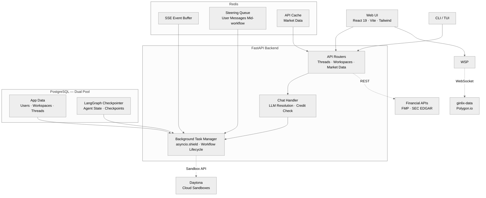
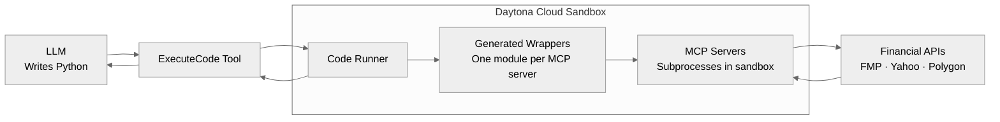

## 真实案例引入：一位分析师的日常工作困境

张明（化名）是某私募的科技行业分析师。2025 年 Q4，他花了整整三周研究 NVIDIA 的数据中心业务护城河——从季报电话会记录、供应链文件、到 H100/H200 的产能分配逻辑，积累了大量笔记和 Excel 模型。

但问题来了：2026 年 2 月，DeepSeek-R2 发布后，客户开始问他"这对 NVIDIA 影响多大"。他打开笔记本，发现自己的分析框架已经支离破碎——三周前的笔记散落在不同文件，LLM 对话上下文早已丢失，要从头回忆当时的核心判断和假设前提。

他需要的是**研究的复利**：让 AI 在每次对话中记住之前的工作，持续累积洞察，而不是每次都从零开始。

这正是 LangAlpha 试图解决的核心问题——将 Claude Code/OpenManus 等代码 Agent 的"持久上下文 + 增量构建"模式，系统性引入金融投研场景。GitHub 已有 **694 Stars**，最新提交距今不到 24 小时，项目获得了 Gemini 3 Hackathon 奖项。

---

## 框架核心拆解

### 整体架构

LangAlpha 的后端基于 FastAPI，前端为 React 19 + Vite + Tailwind Web UI，消息推送采用 SSE（Server-Sent Events），状态持久化用 PostgreSQL 双池（应用数据 + LangGraph Checkpointer），Redis 承担事件缓冲和实时数据缓存。



核心设计理念：**工作空间（Workspace）是研究的容器，线程（Thread）是会话的单元，Agent.md 是跨会话的持久记忆**。

### 编程式工具调用（PTC）：Token 消耗降低一个数量级

传统 Agent 调用金融数据的典型方式：用户问"帮我查一下苹果最新的毛利率"，Agent 调用 `get_financials("AAPL")`，API 返回 200 行原始财务数据，全部塞入 LLM context 窗口。Token 消耗惊人，而且原始数据里大量字段 Agent 根本不需要。

LangAlpha 的 PTC（Programmatic Tool Calling）彻底翻转了这个范式：**Agent 自己写 Python 代码，在云端沙盒执行，只把最终结果返回给 LLM**。



举例：用户请求"对比一下苹果、微软、谷歌过去 5 年的营业利润率，并画出趋势图"。Agent 的思考链不是"调用工具获取原始数据 → 塞入 context"，而是：

```python
# Agent 生成的 PTC 代码示例（LangAlpha 实际生成的代码结构）
import yf_analysis as yf

tickers = ["AAPL", "MSFT", "GOOGL"]
years = range(2019, 2025)
results = {}

for ticker in tickers:
    bs = yf.get_balance_sheet(ticker)
    is_ = yf.get_income_statement(ticker)
    
    operating_margins = []
    for year in years:
        revenue = is_.loc["Total Revenue", year]
        operating_income = is_.loc["Operating Income", year]
        margin = operating_income / revenue
        operating_margins.append({"year": year, "margin": margin})
    
    results[ticker] = operating_margins

# 生成图表
import matplotlib.pyplot as plt
plt.figure(figsize=(12, 6))
for ticker, data in results.items():
    years = [d["year"] for d in data]
    margins = [d["margin"] * 100 for d in data]
    plt.plot(years, margins, marker="o", label=ticker)
plt.title("Operating Margin Trend (5Y)")
plt.legend()
plt.savefig("results/operating_margin_trend.png")
print("Chart saved to results/operating_margin_trend.png")
```

整个多年度数据拉取、跨公司横向比对、图表渲染，全部在沙盒内完成，**LLM 只收到最终图表路径和关键数字**，而不是几千行原始 JSON。

### 持久化工作空间：让 AI 每次都从记忆出发

每个 Workspace 对应一个 Daytona 云端沙盒，带有固定目录结构：

```
/workspace/
├── work/              # 每次任务的临时工作区
│   └── <task_name>/
│       ├── data/      # 原始数据
│       ├── charts/   # 生成的图表
│       └── code/      # 执行的脚本
├── results/           # 最终交付物
├── data/              # 共享数据集
└── agent.md           # 跨会话持久记忆
```

`agent.md` 是 LangAlpha 最关键的设计之一——Agent 在每次会话结束时自动将当前进度、关键发现、待跟进问题写入 `agent.md`，下次会话时 middleware 自动将其注入 LLM 上下文。这意味着：

- 研究"Q2 数据中心需求深度分析"的 Workspace，第二周回来时 Agent **已经知道**之前的核心假设：H100 产能约束、中国区需求占比、Grace-Hopper 供应链风险
- 不需要用户手动总结历史上下文
- 研究自然累积，像一个永不遗忘的分析师助理

### 23 个预置投研技能

LangAlpha 预装了 23 个金融研究技能（Skills），覆盖最常见的投研工作流，每个技能本质上是一个 `SKILL.md` 定义的工作流模板，可通过斜杠命令或自动意图检测激活：

| 技能 | 用途 |
|------|------|
| `dcf-model` | 现金流折现模型构建 |
| `comps-analysis` | 可比公司法分析 |
| `earnings-analysis` | 财报深度解读 |
| `morning-note` | 晨会简报生成 |
| `initiating-coverage` | 首次覆盖报告模板 |
| `thesis-tracker` | 核心投资论点追踪 |
| `sector-overview` | 行业全景扫描 |
| `check-deck` | 投资 Deck 质量检查 |

每个技能对应 MCP 服务器的特定工具子集，Agent 在激活技能时只暴露相关工具，避免过度工具化的上下文污染。

---

## 关键工程洞察

### 1. PTC 模式将 Token 成本从 O(n×数据量) 降为 O(结果)

在传统 JSON Tool Calling 模式下，分析 AAPL/MSFT/GOOGL 三年季度数据，Token 消耗约为 `3 公司 × 4 季度 × 3 年 × 单季度数据量 ≈ 36× 单季度原始数据`。

PTC 模式：Agent 生成 ~20 行 Python 代码（< 500 tokens），沙盒执行后返回一张图和 9 个数字（< 200 tokens）。**整体 Token 减少 95% 以上**，且分析精度更高（代码逻辑可审计、可复用）。

这对需要**大规模量化筛选**（扫描整个 S&P 500 财务数据找异常值）的场景尤为关键。

### 2. 数据供给链的三层降级设计是务实工程

LangAlpha 没有假设用户有彭博终端。它设计了数据 Provider 的三层降级链：

| 层级 | 数据源 | 费用 | 覆盖范围 |
|------|--------|------|----------|
| Tier 1 | ginlix-data（自建代理） | 需要 API Key | 实时 WebSocket、内盘数据、期权数据 |
| Tier 2 | FMP（Financial Modeling Prep） | 免费/付费 | 高质量基本面、财务报表、宏观数据 |
| Tier 3 | Yahoo Finance（yfinance） | 免费 | 价格历史、基本面、ESG、筛选器 |

**系统自动降级**：Tier 1 不可用 → Tier 2 → Tier 3。用户也可以用 `make config` 快速切换层级组合。

这对个人投资者和初创团队意义重大——**零成本启动**，随着研究规模升级到付费数据源，不需要换框架。

### 3. "Flash + PTC" 双模式设计是会话与深度分析的恰当分离

LangAlpha 将 Agent 行为分为两个模式：

- **Flash 模式**：快速会话——行情速查、即时问答、Workspace 管理、轻量级图表分析。延迟低，Token 消耗小，适合"刚才 NVDA 涨了多少"这类问题。
- **PTC 模式**：深度研究——多步骤财务建模、跨时期趋势分析、生成正式报告。启动沙盒有 ~2-5 秒冷启动开销，但分析质量远高于 Flash。

这解决了 AI 投研工具的一个经典矛盾：用户既需要"秒回"的快速查询，也需要"深度"的多步骤分析，传统 RAG + 单 Agent 架构无法同时兼顾。

---

## 信源

- LangAlpha GitHub 仓库：https://github.com/ginlix-ai/langalpha
- LangAlpha README（含架构图与技能列表）：https://github.com/ginlix-ai/langalpha#readme
- LangAlpha API 文档：https://github.com/ginlix-ai/langalpha/tree/main/docs/api
- Financial Modeling Prep（免费数据层）：https://site.financialmodelingprep.com/ （FMP 提供免费注册 API Key）
- Daytona Sandboxes（云端代码执行）：https://www.daytona.io/
- Agent Skills Spec（技能规范）：https://agentskills.io/specification
