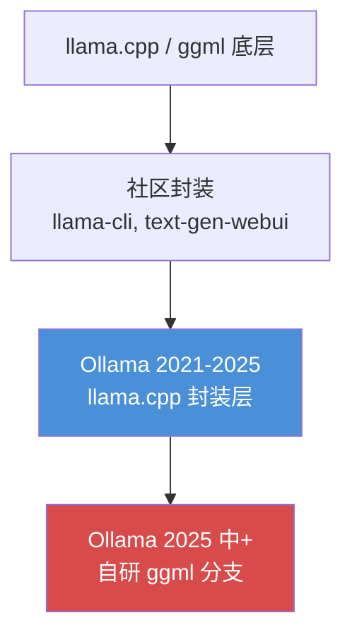

## 真实案例引入：一次生产事故揭开的盖子

2025 年中，某团队的 AI 编码助手在凌晨两点突然崩溃——他们在 Ollama 上跑的好好的 GPT-OSS 20B 模型突然报 GGML tensor type 不支持的错误。同一模型，在 llama.cpp 上运行完全正常。

这不是孤例。2025 年 GitHub 上关于 Ollama 的 issue 爆发式增长：`#3185`（许可证问题，400 天无回应）、结构化输出失效、视觉模型崩溃、多版本 GGML assertion crash。社区反复报告同一个事实：**Ollama 自 2025 年中从 llama.cpp 后端切换到自研 ggml 分支后，引入了 llama.cpp 早已解决的 bug。**

这场崩溃的根源，要从 Ollama 的诞生说起。

## 背景：Ollama 的起源与商业模式

Ollama 由 Jeffrey Morgan 和 Michael Chiang（曾主导 Docker GUI 工具 Kitematic）于 2021 年创办，入选 Y Combinator Winter 2021，2023 年正式公开。核心卖点是"Docker for LLMs"——一条命令下载运行模型。

然而，Ollama 的**全部推理能力来自 llama.cpp**：Georgi Gerganov 于 2023 年 3 月用一晚上 hack 出来的 C++ 推理引擎，让 LLaMA 模型首次能在消费级笔记本上运行。llama.cpp 如今 [GitHub 104,280 stars](https://github.com/ggerganov/llama.cpp)，450+ 贡献者，是几乎所有 GGUF 工具的底层依赖。

**问题来了：** 2023 年整年，Ollama 的 README、官网、营销材料中，**从未提及 llama.cpp**。他们甚至没有在二进制分发包中附带 llama.cpp 的 MIT 许可证声明——这在法律上是明确违规的。

## 核心框架拆解：llama.cpp vs Ollama 推理架构

### 1. 后端演进路径

**Ollama 的核心问题：他们借用了 llama.cpp 的成果，却拒绝公开 credit。当他们终于"独立"时，做出来的是劣质版本。**

### 2. 性能数据对比

社区多组基准测试一致显示相同结论：

| 测试环境 | llama.cpp 吞吐量 | Ollama 吞吐量 | 差距 |
|---------|-----------------|---------------|------|
| GPU 同硬件同模型 | 161 tokens/s | 89 tokens/s | **+81%** |
| CPU | 基准（更快 30-50%） | 较慢 | — |
| Qwen-3 Coder 32B | 基准 | 低约 70% | **-70%** |

**性能差距来源：**
- Ollama daemon 进程层增加不必要开销
- GPU 卸载启发式算法粗糙
- vendored 后端落后上游数月

### 3. 模型命名误导

2025 年 1 月 DeepSeek R1 发布后，Ollama 将 DeepSeek-R1-Distill-Qwen-32B（Qwen 微调版，行为与 671B R1 完全不同）在库和 CLI 中直接标注为 "DeepSeek-R1"。用户 `ollama run deepseek-r1` 实际跑的是一个小得多的蒸馏模型——DeepSeek 官方已正确标注 "R1-Distill" 前缀，Ollama 选择忽略。

### 4. 许可证合规问题

llama.cpp 采用 MIT 许可证，核心要求只有一条：**附带版权声明**。Ollama 最初违反了这一点。经社区长期推动后，最终只在 README 底部加了一行小字。Ollama 联创 Michael Chiang 对社区 PR 的回应耐人寻味：

> "We will be transitioning to more systematically built engines."
> （我们将过渡到更系统化构建的引擎。）

## 关键工程洞察

### 洞察 1：选推理引擎，优先看 upstream 活跃度

llama.cpp 目前保持日更（最近 push: 2026-04-17），Ollama 的自研 ggml 分支则存在已知 bug 且长期不修复。如果你需要运行新模型（如 Qwen3、Gemma3、GLM-5），llama.cpp 是唯一靠谱的选择。

### 洞察 2：别被"易用性"欺骗——易用性不等于可靠性

Ollama 的 `ollama run` 确实比手动编译 llama.cpp 容易，但生产环境的代价是：
- 性能损失 30-80%
- 新模型支持滞后
- 上游 bug 移植后变成自己的 bug

### 洞察 3：开源不等于免疫"攘功"——看代码贡献历史

llama.cpp commits 绝大多数来自 Georgi Gerganov 本人，加上 450+ 贡献者。Ollama 的代码贡献者虽不少，但其核心推理能力实际上是 llama.cpp 贡献者的成果。引用开源项目不是软弱，是基本的工程诚信。

## 替代方案推荐

| 工具 | 适用场景 | 特点 |
|------|---------|------|
| **llama.cpp** (原生) | 需要极致性能和新模型支持 | 最高性能，最快模型支持，CLI 有学习曲线 |
| **text-generation-webui** (oobabooga) | 需要 Web UI | 丰富的 UI 扩展，底层仍是 llama.cpp |
| **vllm** | 需要 GPU 高吞吐服务 | PagedAttention，continuous batching |
| **llama-cli** (llama.cpp 内置) | 轻量级单文件推理 | 零依赖，直接跑 GGUF |

## 总结

Ollama 的故事是一个关于技术诚信和工程选型的反面教材。它以"首个 easy llama.cpp wrapper"起步，积累了数百万用户，却花了多年时间回避 credit 其真正的技术来源。当它最终试图"独立"时，产出的是一个性能更差、bug 更多的后端。

对于本地 LLM 推理，**llama.cpp 仍然是王者**——它是整个本地大模型运动的底层引擎，100,000+ stars，活跃开发，几乎所有主流工具都在其上构建。选择基于它的工具，而不是选择试图取代它却不成功的封装。

> 引用来源：[Friends Don't Let Friends Use Ollama - Sleeping Robots](https://sleepingrobots.com/dreams/stop-using-ollama/)，[llama.cpp GitHub](https://github.com/ggerganov/llama.cpp)，[Ollama GitHub](https://github.com/ollama/ollama)
