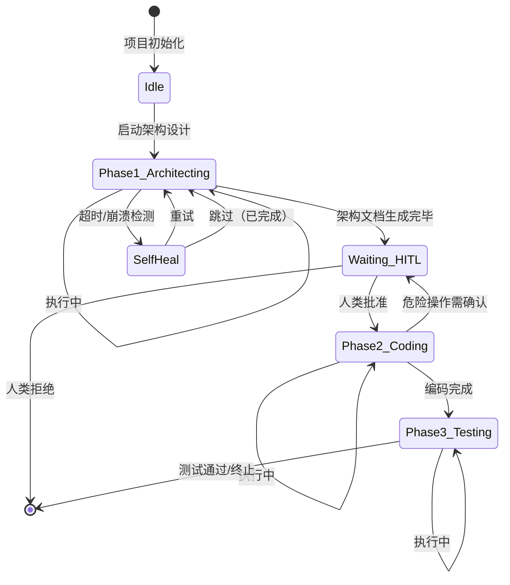

## 一个几乎每个团队都踩过的坑

去年年底，某中型技术团队上线了一套"AI 自动编程流水线"——基于 GPT-4 和代码仓库，每天自动完成 Issue 分解、代码编写和 PR 提交。前三天一切顺利，团队颇有成就感。

第四天早上，他们发现：Agent 在凌晨 3:17 因为一次 API 超时陷入死循环，在 Slack 群里疯狂刷屏了 400 多条错误日志，但没有任何机制让它停下来。值班工程师被叫醒后花了 2 小时才手动终止进程、清空状态、重置上下文。

这不是某家公司的个别故障。**当我们把 LLM 放进一个需要长时间运行的自动化流水线时，几乎必然遇到三个结构性难题：LLM 无状态、任务周期远超单次调用时长、API 不稳定。而大多数团队用来解决这些问题的方案，要么过度依赖人工盯守，要么干脆祈祷 API 别出问题。**

OpenClaw[^1] 试图回答一个更根本的问题：**如果把 AI Agent 当作一台计算机而不是聊天机器人来设计，这些问题是否可以被工程化地解决？**

[^1]: OpenClaw GitHub Repository. https://github.com/openclaw/openclaw

## 为什么说"AI 编程助手"这个定位错了

在深入 OpenClaw 的架构之前，需要先纠正一个常见的理解偏差。

当我们用"AI 编程助手"来描述 Claude Code、Copilot Workspace 这类产品时，隐含的假设是：**人类的每一次操作，都是一次独立的、完整的会话**。用户给一个指令，AI 给一个回复，结束。

但一旦你开始构建自动化流水线，这个模型立刻崩塌——因为流水线的核心特征是：**异步性**（任务可能跨越数小时甚至数天）、**容错性**（中途可能有 API 超时、网络抖动、模型幻觉）和**状态持久性**（下一轮执行必须知道上一轮做到哪了）。

OpenClaw 的核心洞察是：**LLM 本身是一个无状态的"CPU"，而不是一个有记忆的"服务器"。** 因此，要构建长期运转的 AI 流水线，必须给它配上一块"硬盘"——也就是持久化的状态文件。

这就是 OpenClaw 的架构起点。

## 离散状态机：把连续任务切成互不干扰的阶段

OpenClaw 采用了**离散状态机**（Discrete State Machine）的设计思想。简单来说：它不要求 AI 在一次调用中完成整个复杂任务，而是把任务切分成多个阶段（Phase），每个阶段都有明确的输入文件、输出交付物和状态转移条件。



每一轮调度（通常是 Cron 触发），Agent 醒来后第一件事不是"直接干活"，而是**读取状态文件，确定自己处于哪个 Phase、上一轮完成了什么、接下来该做什么**。

### 状态文件：Agent 的"硬盘"

状态文件是整个架构的支柱，本质上是一个 JSON 结构体：

```json
{
  "project_id": "backend-api-v3",
  "current_phase": 2,
  "phase_status": "in_progress",
  "last_active_time": "2026-04-09T03:17:42Z",
  "target_deliverable": "src/handlers/auth.go",
  "heartbeat_interval_minutes": 20,
  "retry_count": 0
}
```

这个文件存在项目根目录，**是整个流水线的 Single Source of Truth**。Agent 每次苏醒，第一条指令永远是：读取这个文件。

这种设计有几个关键优势：

- **崩溃透明**：如果 Agent 崩溃，状态文件不受影响。下一轮醒来，它从状态文件恢复，理论上可以从断点继续
- **多 Agent 协作**：不同阶段的 Agent 可以是不同的模型（Phase 1 用 GPT-4o 做架构，Phase 2 用 Claude 3.7 Sonnet 写代码），只要它们都遵守同一个状态文件协议
- **人类介入点清晰**：只有状态转为 `waiting` 时才需要人类干预，其余时间 Agent 完全自主

### 自愈机制：Agent 崩溃了怎么办？

仅有状态文件还不够。在真实环境中，Agent 可能因为各种原因中途"死亡"：API 超时、模型生成超长上下文导致的 OOM、或陷入无限循环。

OpenClaw 的解决方案是**双重校验自愈**：

1. **心跳超时检测**：每次苏醒时，比较 `last_active_time` 与当前时间。如果差距超过 `heartbeat_interval_minutes`（通常设为 20 分钟），判定上一轮 Agent 已经死亡。

2. **交付物校验**：死亡后，不直接重试，而是先检查 `target_deliverable` 对应的物理文件是否已经存在且内容完整。如果存在，说明上一轮其实已经完成了工作，只是没来得及写回状态文件——此时系统自我修正，将状态推进到下一 Phase。

3. **真重试**：如果物理文件不存在，说明任务确实中途失败，此时刷新时间戳，重新执行当前 Phase。

这套逻辑的核心是：**不要相信 AI 的自我报告，要相信物理文件的存在**。文件是客观存在的，AI 的上下文是主观的、可能被污染的。

## HITL 的正确姿势：只在拐点介入

Human-in-the-Loop（人类介入）是大多数 AI 自动化系统设计失败的重灾区。两种极端都不好：

- **过度 HITL**：每次代码生成都要人审批，导致人类产生通知疲劳，最终变成无脑点"通过"
- **零 HITL**：完全自主运行，结果失控时没有任何安全网

OpenClaw 的原则是：**只在架构拐点请求介入，日常执行保持绝对静默**。

具体判断标准：

| 必须挂起 | 禁止打扰 |
|---------|---------|
| 架构设计初稿完成（定方向） | 常规业务逻辑编写 |
| 涉及破坏性重构或数据删除 | 修复普通编译报错 |
| 连续 3 次无法自愈的死循环 | CSS 样式调整、依赖版本升级 |
| 触及合规或安全边界 | 写测试用例、常规代码补全 |

当触发必须挂起的情况时，Agent 向人类发送消息的方式也很有讲究。OpenClaw 建议**所有通知必须带上身份前缀**，例如：

```
[backend-api-v3 流水线 · Phase 2 待审核]
架构设计已生成，请确认后我将继续执行编码任务。
```

这看起来是小事，但在团队同时跑多个 AI 自动化任务时，带身份前缀的消息能极大降低认知负担，让工程师一眼看出这条消息来自哪个项目、哪个阶段。

## 角色解耦：为什么不能让一个 Agent 从头写到尾

传统的"单一 Agent 全流程"有一个根本问题：**不同的任务需要完全不同的思维模式**。

- 架构设计阶段需要发散性思维，要把问题展开，考虑多种路径
- 编码阶段需要收敛性思维，要根据既定架构死磕实现，处理各种边界情况
- 测试阶段需要"挑刺"心态，要主动寻找漏洞和安全问题

把这三种思维塞进一个 System Prompt，让同一个 Agent 在同一个会话里完成所有工作，结果通常是每个阶段都做得"还行"但都不够好——模型会在发散和收敛之间反复横跳。

OpenClaw 的解法是**通过 Phase 动态切换 Agent 的"角色面具"**：

- **Phase 1（架构师）**：被配置为发散型 Prompt，输出 Markdown 架构文档
- **Phase 2（工程师）**：被配置为收敛型 Prompt，严格按照架构文档执行代码实现
- **Phase 3（QA）**：被配置为对抗型 Prompt，专注于寻找漏洞和边界 case

阶段之间的交接通过**物理文件**完成，而不是上下文记忆——Phase 1 的输出文件是 Phase 2 的输入文件，Phase 2 的输出文件是 Phase 3 的输入文件。这种"物理交接"保证了信息传递的零损耗。

## 实时性与稳定性的取舍

OpenClaw 的架构本质上是在做一个取舍：**用实时性换稳定性**。

传统的 LLM 调用是同步的：我发一个请求，等一个回复，完成。但 OpenClaw 把这个过程变成了异步的：发起任务 → 等待状态转移 → 检查交付物 → 继续或终止。

这意味着：

- **好处**：可以 7x24 小时运行，中途崩溃可以恢复，不需要人工盯守
- **代价**：单次任务完成的周期变长（从分钟级变成小时级甚至天级）

对于需要快速反馈的场景（如 IDE 内实时补全），这显然不是正确的方案。但对于**后台自动化流水线**（CI/CD、数据管道、报告生成、代码审查），这个取舍是值得的。

## 给工程师的实践建议

如果你想在自己的团队里引入类似的架构，有几个关键点需要注意：

**1. 从单文件状态机开始**
不需要上来就搞一整套复杂的多 Phase 系统。从最简单的开始：在项目根目录放一个 `pipeline_state.json`，每次 Cron 触发时读取它、判断该做什么、执行、覆写状态。最小化可行系统跑通后，再逐步增加 Phase。

**2. 心跳间隔要足够长但不能太长**
设得太短（如 5 分钟）会导致误判——LLM 生成本身就可能花 5-10 分钟。设得太长（如 2 小时）会导致问题发现太晚，损失太大。20-30 分钟是一个经过验证的合理起始值。

**3. 交付物校验要定义清晰**
"文件存在"不等于"工作完成"。你需要定义清楚每个 Phase 的**完成标准**——是文件存在就够了，还是需要文件通过 lint/编译/测试？标准越清晰，自愈判断越准确。

**4. 日志要写入状态文件**
每次状态转移时，把转移原因（成功完成/超时重试/HITL 批准）写入状态文件的 `history` 字段。这个日志是事后排查问题的唯一依据。

---

*[^1] OpenClaw GitHub: https://github.com/openclaw/openclaw | 353k stars, 活跃维护中*
