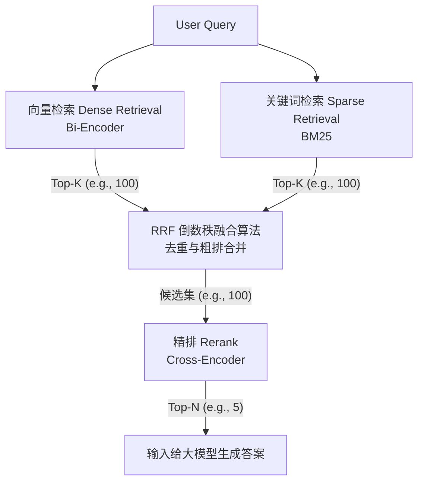

在构建 RAG（检索增强生成）系统或企业级 AI 搜索时，我们通常会用到“向量数据库”。直觉上，向量检索（Recall）已经按照相似度从高到低给出了 Top-N 的结果，这不就已经排序好了吗？为什么还要在后面费时费力地加一层 Rerank（重排）模型？

简单来说：**向量召回为了“快”牺牲了“准”，而重排为了“准”牺牲了“快”。**

本文将带你扒开数学公式的外衣，用最通俗的语言，结合信息论与工程实践，彻底搞懂这背后的技术差异与架构演进。

## 一、 粗排与精排：一场“海选”与“面试”的博弈

要理解这个架构，我们可以把“向量检索 + 重排”的流水线，比作大公司的**招聘过程**。

### 1. 召回阶段（向量检索）：简历海选
假设你要招一名高级研发工程师，收到了 10 万份简历。系统通过关键词和基础向量匹配，在几秒钟内快速筛选出了最符合特征的 **100 个人**。
* **优势：** 极快，能从海量数据中迅速缩小范围。
* **劣势：** 系统只看“标签”或“大致轮廓”，它不知道这 100 个人里谁是只会背面试题的“水货”，谁才是真正的技术大牛。原本实力第 10 的人，可能由于简历没写好，评分反而比不上排名第 1 的“面霸”。

### 2. 重排阶段（Rerank模型）：专家面试
面对筛选出的 100 人，你不可能全部录用，你需要最精准的那几个。于是技术总监亲自出面，对这 100 人进行深度面试，考察底层逻辑、系统设计和实战细节。
* **优势：** 判断极其准确，能把被埋没的真正高手提拔到 **Top 1**，淘汰掉虚有其表的人。
* **劣势：** 速度极慢，计算成本极高（你不可能对 10 万人挨个进行一小时的深度面试）。

所以，**重排不是多此一举，而是为了弥补向量检索“只看长相、不看内涵”的天然短板。**

## 二、 核心技术揭秘：提前交卷 vs 当面对峙

为什么向量检索会“看走眼”，而重排模型能“看穿一切”？这源于两者底层架构的本质区别：**Bi-Encoder** 与 **Cross-Encoder**。

### 1. 向量检索的基石：Bi-Encoder（双编码器）
向量检索之所以能做到毫秒级响应，是因为它采用了“分离计算”的模式。

* **工作原理：** 就像两个互不相识的学生在异地考试。问题（Query）编码器独立把问题浓缩成一串数字（向量）；文档（Document）编码器提前把海量文档浓缩成一串串数字并存入数据库。搜索的过程，仅仅是在高维空间中对比这两串数字有多近（通常计算余弦相似度）。
* **致命缺陷（细节丢失）：** 文档在被“压缩”成固定向量时，因为不知道用户未来会问什么，所以很多微小的细节会被抹平。它能理解“苹果手机好用吗”和“如何削苹果皮”都有“苹果”的语义，但很难精准分辨复杂的逻辑关系。

### 2. 重排模型的核心：Cross-Encoder（交叉编码器）
重排模型（如 BGE-Reranker、Cohere Rerank）为了追求极致的准确，强制让问题和文档“当面沟通”。

* **工作原理：** 它将 `[问题] + [文档]` 拼接成一段完整的文本，一次性喂给深度神经网络（如 BERT 或更大参数的 Transformer）。
* **降维打击（深度交互）：** 在这个过程中，模型内部的注意力机制（Self-Attention）会在每一个字、每一个神经元层级进行全方位的对比。当模型读到问题中的某个限制条件时，会立刻扫视后面的文档中是否出现了逻辑冲突词。它不仅看“词”，更看“逻辑关系、条件限制和否定结构”。

### 3. 一个直观的 Bad Case（反面案例）

为了更好地理解两者的差异，我们来看一个真实的例子：

> **用户 Query：** “北京到上海的高铁，不要经过南京的班次。”

* **Bi-Encoder 向量检索的结果：** 极大概率会召回含有“北京”、“上海”、“高铁”、“南京”的文档，比如《北京到上海高铁途经南京站的时刻表》。因为它捕捉到了大量的实体语义重合，却忽略了否定词“不要”的强逻辑反转。
* **Cross-Encoder 重排的结果：** Transformer 的自注意力机制会敏锐地捕捉到“不要”与“南京”之间的强烈依赖与排斥关系，从而将这篇途经南京的文档得分极大地拉低，将真正符合条件的直达或绕行班次排到前面。

## 三、 信息论视角：从有损压缩到无损推演

为什么 Bi-Encoder 会漏掉“不要”这种关键信息？从信息论的角度来看，这本质上是一个**有损压缩导致的信息丢失（Information Loss）**问题。

把一段 500 字的丰富文档，强制压缩成一个固定维度（比如 768 维 或 1536 维）的浮点数数组，在数学上是一个剧烈的“降维”过程。在这个压缩降维的过程中，文档的局部特征、复杂的语序逻辑、以及长尾词汇（即低频但高信息量的词，比如某个特定的 Error Code 或否定词），很容易被淹没在整体语义的均值之中。信息熵不可避免地增加了。

而 Cross-Encoder 则是将 Token 级别的序列直接输入 Transformer 计算 Attention。网络能够充分捕捉 Query 和 Doc 之间每一个 Token 的互相影响，这是一种接近**无损**的逻辑推演，代价则是极高的计算熵（算力消耗）。

## 四、 进阶前沿：Late Interaction（延迟交互）架构的折中艺术

既然 Bi-Encoder 容易损失细节，而 Cross-Encoder 又太慢，业内有没有既快又准的方案？有，那就是以 **ColBERT** 为代表的 Late Interaction（延迟交互）架构。

* **原理解释：** Late Interaction 不再把整篇文档简单粗暴地压缩成“一个”整体向量，而是保留文档中**每一个词（Token）**的向量表示。在检索时，让问题中的每个词去和文档中的每个词进行轻量级的相似度计算（MaxSim 操作），然后汇总得分。
* **比喻延续：** 就像让海选机器不仅看求职者的“整体评分”，还能飞速扫一眼求职者的“每一项具体技能”，但又不至于像专家面试那样花一个小时去深挖。
* **价值：** 这种架构在保持了接近 Bi-Encoder 检索速度的同时，大幅提升了对细粒度信息的匹配精度，是目前高级 RAG 演进的重要方向（如 ColBERTv2、Jina-ColBERT）。

## 五、 工程最佳实践：混合检索与 Rerank 的漏斗模型

工程师读者不仅想知道“为什么”，更想知道“怎么做”。在真实的生产环境中，仅靠单路向量检索通常是不够的。业界标准的 RAG 检索流水线，是一个精密的**漏斗模型**：

1. **路基（双路召回）：** 使用 **BM25** 抓取精确关键词、专有名词、SKU 等硬性匹配；同时使用**向量召回**抓取语义相似、同义词、泛化概念。两者互补，各召回 Top-K 形成宽广的候选池。
2. **融合（RRF 算法）：** 通过倒数秩融合（Reciprocal Rank Fusion）等算法，把两路结果进行归一化、合并与去重，形成统一的粗排列表。
3. **塔尖（精排 Rerank）：** 将粗排后的 Top 候选（通常 50-100 个）送入 Cross-Encoder 模型进行精准打分，最终输出最核心的 Top-5 喂给 LLM。

## 六、 算力与工程的 Trade-off（权衡艺术）

任何架构设计都是成本与收益的权衡（Trade-off）。为什么 Rerank 只能处理几十到上百个文档，而不能直接对全局数据使用？原因在于时间复杂度的鸿沟：

* **向量召回的复杂度：** 由于使用了 HNSW 或 IVF 等近似最近邻（ANN）索引，搜索的时间复杂度接近 $O(\log N)$。它能在几毫秒内从千万级甚至亿级数据中完成检索。
* **重排（Cross-Encoder）的复杂度：** Transformer 的自注意力机制计算量对序列长度是平方级增长的。其时间复杂度高达 $O(K \cdot L^2)$（$K$ 是传入的候选文档数，$L$ 是 Query + Doc 拼接后的 Token 长度）。如果强行用 Cross-Encoder 扫库，系统响应时间将是按分钟甚至小时计算的。

**工程经验：** 在实际业务中，系统架构师需要根据 SLA（服务等级协议）的 Latency（延迟）要求动态调整传入 Rerank 的 $K$ 值。例如：对响应时间极其敏感的 C 端搜索，$K$ 可能设为 20；而在对准确率要求极高的 B 端知识挖掘场景，$K$ 可以放大到 150 以换取更精准的结果。

## 七、 总结对比

最后，我们用一张图表，直观总结召回与重排这两个阶段的核心差异：

| 维度 | 召回阶段 (Bi-Encoder) | 重排阶段 (Cross-Encoder) |
| :--- | :--- | :--- |
| **交互方式** | 独立处理（Query 和 Doc 互不相见） | 拼接处理（Query 和 Doc 深度碰撞） |
| **预计算** | 支持（文档向量提前计算并入库） | **不支持**（必须根据 Query 现场推理） |
| **处理数据量** | 海量全库数据（千万/亿级别） | 极小量候选集（召回后的 Top 50 或 100） |
| **逻辑敏感度** | 对大意敏感，对细微逻辑、否定词较弱 | 对**因果、否定、条件逻辑**极其敏感 |
| **时间复杂度** | 极低（基于索引的 $O(\log N)$ 距离计算） | 极高（深度神经网络的 $O(K \cdot L^2)$ 推理） |
| **核心目标** | 保证“不漏”（大范围网罗，追求 Recall） | 保证“最优”（精准逻辑匹配，追求 Precision） |

在现代 RAG 系统架构中，**“双路粗排捞人 + Cross-Encoder 精排选优”** 的组合拳，已经成为了平衡“计算性能”与“问答质量”的黄金标准。理解了它们底层的得与失，我们才能在构建复杂的 AI 业务系统时游刃有余。